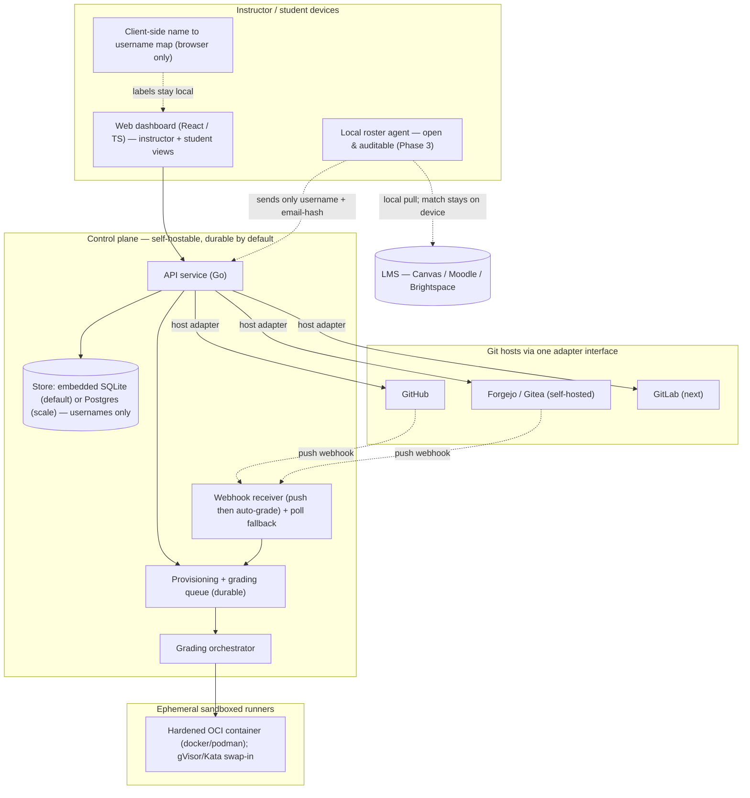

# Design Doc — Open-Source Classroom Platform

> **Working name: Quad** (placeholder — "university quad / common ground"; swap freely). **[OPEN]**
> Status: **v1 in progress.** The core vertical slice is validated end-to-end against
> both the GitHub model and a self-hosted **Forgejo/Gitea** instance (OAuth →
> roster → repo provisioning from template → sandboxed grading). Items still needing
> a call are marked **[OPEN]**; previously-open decisions now settled are noted inline.

## 1. What this is

An open-source platform for distributing, collecting, and auto-grading coding
assignments backed by Git repositories — the GitHub Classroom workflow, rebuilt
to be **host-agnostic, privacy-minimal, and self-hostable**.

The wedge is the quadrant nobody currently owns. GitHub Classroom is being
decommissioned (sign-ups already disabled; full shutdown August 28, 2026; final
data deletion September 4). The successors split into two camps:

- **Thin GitHub-only clones** — the blessed open-source successor (Classroom 50)
  is GitHub-only and GitHub-Actions-only.
- **Hosted commercial** — Codio (the exclusive commercial partner) and CodeGrade
  are closed, hosted products centered on a cloud IDE or a grading engine.

Nobody is convincingly delivering open-source + works against self-hosted Git
(Forgejo/Gitea) + stores almost no student data + the institution can run it
itself. That is the durable position for a tool educators can *trust* after being
burned by platform risk.

### Non-goals for v1
- LMS integration via LTI (later — Phase 4).
- A cloud IDE / in-browser code editor (not our job; students keep their Git workflow).
- Being a general LMS (grades, forums, content delivery). We do assignments + grading.

## 2. Design principles

1. **The Git host is a pluggable adapter.** Everything host-specific lives behind
   one interface. v1 ships GitHub and **Forgejo/Gitea**; GitLab is additive, not a
   rewrite.
2. **Privacy by architecture, not by policy.** The control plane stores Git
   usernames, not student identities. Real names and SIS IDs never reach the
   server (see §6). The durable identity anchor is the host's numeric user id, so
   renames and recycled usernames don't corrupt identity.
3. **Self-hostable first, and trivially so.** The common case is *one binary* —
   durable on an embedded store with no external service (see §9). Postgres is for
   institutions and scale, not a prerequisite for trying it. The hosted offering
   comes later and is a scoped data processor, not the system of record.
4. **Portable autograding.** Grading is defined by a host-neutral spec and runs in
   our own sandboxed runners — not locked to GitHub Actions.
5. **Operability and ergonomics are features, not afterthoughts.** Setup, the
   instructor surface, the student feedback loop, and observability are first-class
   (§§8, 12, 13). A tool competing on *trust* cannot be hard to run or opaque to use.
6. **Interoperable / no lock-in.** CSV roster import/export, full data export, a
   documented data model, an open adapter SDK, and a clean SQLite→Postgres migration
   path so growing out of "solo" is painless.

## 3. Scope

### v1 (MVP) — in
- Classrooms backed by a Git host org/group (multi-host: a classroom carries its
  own `host` + `host_namespace`).
- Self-claim join flow (student authenticates with the host via OAuth; only their
  username is bound to a roster entry).
- Assignments from a template repo; individual (group: see **[OPEN]** below).
- Repo provisioning at scale via an idempotent, rate-limit-aware queue, whose first
  step is an idempotent `EnsureNamespace` (creates the org/group if absent).
- Deadlines (repo locked / pushes restricted after the deadline).
- Minimal sandboxed autograding + score capture.
- **Student-facing experience** — a student view with repo link, instructions,
  deadline, grading status, and per-test results; the submit→regrade→improve loop
  (see §8, §12).
- **Durable by default** + **one-command bring-up** + **`quad doctor`** preflight
  (see §9, §12).
- CSV export of scores keyed by username; full data export.
- A clean web dashboard (instructor + student).

### v1 — out (deferred to later phases)
- GitLab adapter (Phase 2 tail), LMS agent (Phase 3), hosted multi-tenant + LTI
  (Phase 4), feedback-via-PR review UI (fast follow on top of the student feedback
  loop).

### Phase plan
1. **MVP** — GitHub adapter + the full vertical slice above. *Done.*
2. **Host-agnostic** — **Forgejo/Gitea shipped and live-validated**; GitLab next.
   *This is the differentiator; it is now real.*
3. **Ephemeral LMS agent** — local roster pull + match (§6).
4. **Hosted + LTI 1.3** — multi-tenant SaaS, NRPS roster sync, AGS grade passback.

**[OPEN] — group assignments.** The data model supports `type: group`, but the
provisioning path is currently exercised for individual only. Decision: build
team formation + one-repo-per-team-with-N-collaborators for v1, or move group to a
fast follow. Don't claim it as done until the path is tested.

## 4. Architecture overview

**Components**
- **API service** — REST/JSON control plane; owns the data model and orchestration.
- **Host adapters** — implement one interface per Git host (§7).
- **Provisioning + grading queue** — durable, idempotent, retryable jobs; the thing
  that keeps a 300-student class from melting against host rate limits.
- **Grading orchestrator + sandboxed runners** — runs untrusted student code in
  ephemeral, isolated containers (§8).
- **Webhook receiver** — accepts host push events and enqueues grading; polling is
  the fallback baked into the adapter. *(Receiver is the next slice; see §12.)*
- **Web dashboard** — instructor + student SPA, including the client-side name map.
- **Local roster agent** — separate, open, auditable; never required (§6).

## 5. Data model (the privacy-critical seam)

Field lists, not full DDL — precise enough to build from. (Reflects the implemented
schema; key uniqueness constraints noted.)

**`classroom`** — `id`, `name` (course label; metadata, not student PII), `host`
(`github|gitlab|forgejo`), `host_namespace` (org/group), `created_by` (nullable),
`created_at`, `settings` (jsonb).

**`user`** (platform operator — instructor/TA) — `id`, `host`, `host_user_id`
(numeric; the durable anchor), `host_username`, `email`, `created_at`.
**Unique `(host, host_user_id)`** so renames keep one identity and a recycled
username becomes a new identity. The operator is the account holder, so their email
is fine to store. Tokens are not stored long-term where avoidable — prefer GitHub
App installation tokens minted on demand; for hosts without that, store encrypted
refresh handles.

**`assignment`** — `id`, `classroom_id`, `title`, `slug`, `template_ref`
(`host` + `namespace` + `name` + `ref`), `type` (`individual|group`), `deadline`
(nullable), `access_policy`, `grading_spec_ref` (defaults to `grading.json` in the
template repo), `created_at`.

**`roster_entry`** — the privacy-critical table.
`id`, `classroom_id`, `host`, `host_username` (the durable identity anchor),
`email_hash` (nullable; **salted one-way hash**, for client-side re-matching only),
`status` (`invited|active|removed`), `claimed_at`.
**Not stored: legal name, SIS ID, plaintext email.** Any human-readable label the
instructor wants stays in their browser (§6), not the server.

**`submission`** — `id`, `assignment_id`, `roster_entry_id`, `repo_ref`,
`latest_commit_sha`, `last_activity_at`, `status`. **Unique
`(assignment_id, roster_entry_id)`** — one submission per student per assignment;
re-claim is idempotent and never double-enqueues.

**`grade`** — `id`, `submission_id`, `score`, `max_score`, `breakdown` (jsonb,
per-test — this is what the student feedback view renders), `run_id`, `graded_at`.
*This row, joined to `roster_entry`, is an education record (see §10).*

**`provisioning_job`** — `id`, `type`, `target` (assignment/roster refs), `status`
(`pending|in_progress|succeeded|failed`), `attempts`, `idempotency_key`,
`last_error`, `scheduled_at`. Idempotency keys ensure retries never double-create.

**`grading_run`** — `id`, `submission_id`, `status`, `runner`, `started_at`,
`finished_at`, `result`, `logs_ref` (logs to object storage / ephemeral).

## 6. Roster & the ephemeral LMS agent

**Goal:** seed the roster from an LMS without the control plane ever receiving
student names, SIS IDs, or plaintext emails.

**The usability bridge (v1 dashboard feature):** the server stores usernames, but
instructors think in names. The **name↔username map lives in the instructor's
browser** (local store the instructor maintains, or re-derived from a fresh local
pull each session). The dashboard renders real names *locally*; the server never
sees them. This is what makes the privacy invariant a feature instead of a tax, so
it ships with v1's dashboard — not only with the Phase 3 agent.

**Agent flow (Phase 3)**
1. The agent runs **locally** in the instructor's authenticated context — a browser
   extension or a CLI, fully open-source and auditable, with no phone-home.
2. It pulls the roster via the **LMS's instructor-token REST API** (Canvas, Moodle,
   Brightspace all expose one). DOM scraping is the fallback only.
3. The agent's only outputs to the server are join links / invite tokens. Students
   self-claim via OAuth on the Git host. The server persists `host_username`
   (+ optional `email_hash`).
4. The agent is also how you chase non-joiners (it knows who *should* have joined)
   without that list living server-side.

**Later (Phase 4):** LTI 1.3 Names-and-Roles (NRPS) is the "official" version, but
it requires the institution to register the tool — exactly the friction we avoid
for v1, so it's correctly a stretch goal.

## 7. Host-adapter interface (the other load-bearing seam)

One contract; each host implements it.

- `host() -> Host`
- `ensureNamespace(name) -> namespaceRef` — **provisioning's first step; must be
  idempotent.** Every student after the first targets an existing namespace, so an
  implementation that errors on "already exists" is a bug. (Learned the hard way:
  the worker originally skipped this call, which GitHub masked because instructor
  orgs pre-exist and Forgejo exposed because the org genuinely needed creating.)
- `createRepoFromTemplate(templateRef, namespace, repoName, opts) -> repoRef`
- `repoExists(repoRef)`
- `setCollaborator(repoRef, username, role)` / `removeCollaborator(repoRef, username)`
- `latestCommit(repoRef) -> {sha, timestamp}`
- `lockRepo(repoRef)` / `unlockRepo(repoRef)` — deadline enforcement
- `ensureWebhook(repoRef, spec)` — push events trigger grading (poll as fallback)
- `dispatchGrading(...)` / `gradingResult(...)` — abstract; maps to host-native CI
  *or* hands off to our orchestrator. **We grade in our own orchestrator, so
  `dispatchGrading` is intentionally `ErrNotImplemented`;** the optional host-native
  mode (emit Actions config) is deferred.
- auth: GitHub App installation tokens vs Forgejo/GitLab OAuth + PAT.

**Mapping note:** GitHub uses "template repos + GitHub App"; Forgejo/Gitea is close
to GitHub's model, speaks a standard Gitea `/api/v1`, and is itself written in Go —
adapter affinity and community overlap are real bonuses, and the clean API boundary
is exactly the seam an *official* Forgejo Classroom feature could slot into. GitLab
uses "projects + groups + OAuth app." Idempotency note for Forgejo: org/repo
creation can return 409/422 when the resource exists — treat as success only after
re-verifying existence, never blindly (a bare 422 can also mean a real validation
failure, e.g. a template repo not marked as a template).

## 8. Autograding

- **Portable spec** in the template repo — **`grading.json`** today (the spec type
  also carries YAML tags; the loader reads JSON). Defines test commands, scoring
  weights, per-test timeouts, resource limits, and a network policy.
- **Execution** in **ephemeral, isolated containers.** v1 ships **hardened OCI
  containers** via docker/podman: `--network none` (per the spec's network policy),
  `--cap-drop ALL`, `--security-opt no-new-privileges`, `--read-only` root with a
  tmpfs `/tmp`, non-root user, and `--pids`/`--memory`/`--cpus` caps, one container
  per step, killed on timeout. This is solid hardening but **not** VM-class
  isolation; **gVisor / Kata is a documented runtime swap** (`--runtime`) for
  higher-assurance deployments. We don't claim Firecracker-class isolation out of
  the box.
- **Offline grading.** Because grading runs with no network, dependencies must be
  baked into the grading image — `grading.json` pins the image. To keep this from
  being a DevOps tax on instructors, v1 provides **prebuilt language images**
  (python/node/java/…) and a build helper, plus a **local dry-run** so an assignment
  can be graded against a reference solution before it's published.
- **Triggering & the feedback loop.** Grading is currently **operator-triggered**;
  the next slice is the **webhook receiver** so a student push auto-enqueues a
  regrade. Results flow back to the student: the per-test `breakdown` is surfaced in
  the student view (and, fast-follow, as a comment/checks summary on their repo), so
  the loop is **submit → see what failed and why → fix → resubmit → see improvement**,
  with an attempt history. Optional host-native mode (emit Actions config) remains
  available for instructors who prefer the host's runners.

Validation: educators already self-host CI runners specifically to escape Actions
minute limits, which tells us a portable runner has demand.

## 9. Tech stack & storage (settled)

- **Control plane: Go.** Single-binary self-host (huge for university IT), strong
  concurrency for the provisioning queue, cloud-native ecosystem for grading
  sandboxes, and community overlap with Forgejo/Gitea. *(Was [DECIDE]; settled.)*
- **Frontend: React + TypeScript** SPA, instructor + student views.
- **Storage — the split, settled:**
  - **Default: embedded SQLite** (`modernc.org/sqlite`, pure-Go, **no cgo** —
    preserves cross-compilation). No `QUAD_DATABASE_URL` set → Quad opens/creates a
    local file in WAL mode and is durable out of the box. **One binary + a file**,
    zero external service. This is the headline self-host story and also lets
    contributors run the real store with no setup.
  - **Scale: Postgres**, activated by `QUAD_DATABASE_URL` — for institutions, hosted
    multi-tenant, and horizontal/parallel workers.
  - **Tests/CI: in-memory** store, plus an explicit `--ephemeral` flag.
  - Both Postgres and SQLite use `database/sql`, so the SQL layer is shared. The one
    real divergence is the queue claim: Postgres uses `FOR UPDATE SKIP LOCKED` for
    parallel workers; SQLite uses a single-writer claim (`BEGIN IMMEDIATE`), which is
    correct because SQLite deployments are single-process.
  - **Scaling boundary (state it plainly):** SQLite = a single instance; fine for any
    realistic class or department (writes are bursty but modest and already bounded
    by host rate limits). Postgres = multiple app/worker instances or large
    multi-tenant.
  - **No lock-in:** `quad export` / `import` and a direct **SQLite→Postgres migrate**,
    so a project that outgrows "solo" moves without pain. Backups are "copy the file"
    (SQLite) or `pg_dump` (Postgres).
- **Grading runner:** container-based, language-agnostic (§8).

*Why not Postgres-only or compose-default:* `docker compose up` still requires Docker
on the instructor's machine; a single `./quad` that just works is dramatically lower
friction and strengthens principle §3. The dependency tradeoff (one sizable pure-Go
module) is worth it; a `-tags nosqlite` build remains for the dependency-averse.

*Contributor-reach note:* the strongest alternative was full-stack TypeScript/Node
(largest contributor pool). Go's edge — single-binary ops + Forgejo affinity —
won; revisit only if contributor reach ever outweighs deployment simplicity.

## 10. Compliance posture (honest version) **[DECIDE later, with counsel]**

Storing only usernames + hashed emails **reduces** the PII surface (real data
minimization). It does **not** eliminate FERPA: a score tied to an identifiable
student is an education record regardless of whether we store their legal name.
The clean answers:

- **Self-hosting** — records never leave infrastructure the institution already
  stewards. The strongest FERPA story, and another reason to lead with it.
- **Hosted offering** — operate as a clearly-scoped data processor with a DPA; keep
  minimization; let the institution remain the system of record.

(Not legal advice — strategic framing to validate with counsel before any hosted
launch.)

## 11. Licensing (settled)

**Recommended split, adopted:**
- **AGPL-3.0-or-later for the control plane** (`cmd/`, `internal/`) — network
  copyleft stops a competitor from running a closed hosted fork without contributing
  back; fits the community-owned / anti-platform-risk ethos.
- **Apache-2.0 for the interoperability primitives** — `pkg/adapter` (the host
  adapter SDK) and `pkg/gradingspec` (the portable grading spec). The platform stays
  copyleft; the things that make it *interoperable* are maximally reusable.

(Not legal advice.) *(Was [DECIDE]; settled.)*

## 12. Operability & experience (the "usable by a real instructor — and student" slice)

§§1–11 describe what to build; this section is how we make it *trusted in practice*.
It is a first-class workstream, sequenced after the architecture validation that is
now complete.

**Instructor operability**
1. **Durable by default** (§9) — a restart never wipes a classroom. Foundational;
   everything else assumes durable state. *(First.)*
2. **Dashboard as the operator surface** — no curl, no cookies. The forms cover the
   full flow (classroom with host + namespace, assignment with template, roster, a
   grade button); the browser carries the session.
3. **`quad doctor` + a config file** — replace the env-var block with a config file,
   and a preflight that checks host reachability, token scopes, and the OAuth
   redirect *before* a runtime 401. (Every failure encountered during bring-up would
   have been caught here.)
4. **One-command bring-up** — `docker compose up` for Quad + its DB + (optionally)
   Forgejo, with named volumes so data persists across container recreation.
5. **Operator observability** — provisioning/grading job states and failure reasons
   visible in the dashboard, so nobody greps logs; plus manual **regrade / grade
   override** for appeals and edge cases (instructor stays in control).

**Student experience** (the largest current gap — see Appendix A, Tier 1)
1. **Student view** — repo link, instructions, deadline, live grading status
   (queued / running / done), current score.
2. **Visible feedback** — per-test results from the `breakdown` (what passed/failed
   and why), not an opaque number.
3. **The iteration loop** — webhook-driven auto-regrade on push, with attempt
   history, so students learn by resubmitting.
4. **Accessibility** — both UIs target WCAG; "adapt to students" includes students
   who use assistive technology.

**Near-term plan.** The MVP vertical slice (classroom → claim → provision → grade →
score) is validated, including on self-hosted Forgejo. Next, in order: **(a)** durable
default + embedded store; **(b)** `EnsureNamespace` in the provisioning path +
adapter idempotency; **(c)** the student feedback loop (webhook receiver → results
view); **(d)** authoring ergonomics (scaffold, prebuilt images, local dry-run);
**(e)** `quad doctor` + config + compose. OSS hygiene stays maintained throughout
(`LICENSE`, `README`, `CONTRIBUTING`, code of conduct, issue/PR templates, public
roadmap) — this is how you compete with a "blessed" alternative on trust.

## 13. Open decisions (need a call)

1. **Name** — replace the "Quad" placeholder (or keep it). *(The only original
   open decision still open.)*
2. **Group assignments** — build for v1 vs fast follow (§3).
3. **Isolation upgrade timing** — when (and whether) to make gVisor/Kata the default
   runtime vs documented swap (§8), based on threat model for shared/hosted
   deployments.
4. *(Resolved, for the record)* tech stack → Go + React/TS; storage → SQLite-default
   + Postgres-scale; license → AGPL server + Apache primitives; hosting → self-host
   first; activity detection → webhooks + poll fallback in the adapter.

---

## Appendix A — Missing-feature backlog (prioritized by ease / trust / student-fit)

**Tier 1 — closes core value-prop gaps; do first.**
- **Student feedback loop** — student view + per-test results + push→regrade→improve
  with attempt history. Depends on the webhook receiver. *(Without it, grading is a
  black box and the pedagogical loop is broken.)*
- **Client-side name↔username map** in the dashboard — makes the privacy model usable
  rather than a tax (§6).
- **Assignment-authoring ergonomics** — `quad new-assignment` scaffold, prebuilt
  language grading images + build helper, and a local dry-run before publish.

**Tier 2 — near-term.**
- Per-student **deadline extensions / late policy** (flexibility + accommodations).
- **Operator observability** in the dashboard (job states, failure reasons) + manual
  **regrade/override**.
- Full **data export** + **SQLite→Postgres migration**.
- **Group assignments** decision and build (§3, §13).

**Tier 3 — trust & polish, ongoing.**
- **Accessibility (WCAG)** across both UIs.
- **Audit log** (provisioning actions, grade changes, deadline edits).
- **Security/isolation doc** with the gVisor/Kata upgrade path (§8).
- **Backups** documented (copy the SQLite file / `pg_dump`).

## Appendix B — Design↔implementation reconciliations (this revision)

Recorded so the doc and the code don't silently drift again:
- **Durability:** the design always specified a durable, idempotent, Postgres-backed
  queue; the implementation had shipped in-memory store + queue *defaults*, which
  wiped state on restart. Resolved by making durable the default (§9).
- **`EnsureNamespace`:** present in the adapter contract but not called by the
  provisioning worker; now specified as provisioning's idempotent first step (§7).
- **Sandbox isolation:** doc aspired to gVisor/Firecracker/Kata; v1 ships hardened
  docker/podman with that as a documented runtime swap (§8).
- **Spec format:** `grading.yaml` → **`grading.json`** (loader is JSON) (§8).
- **Grading trigger:** "push triggers grading" is currently operator-triggered; the
  webhook receiver is the next slice (§8, §12).
- **Forgejo:** moved from "deferred / Phase 2" to **shipped and live-validated**
  (§3).